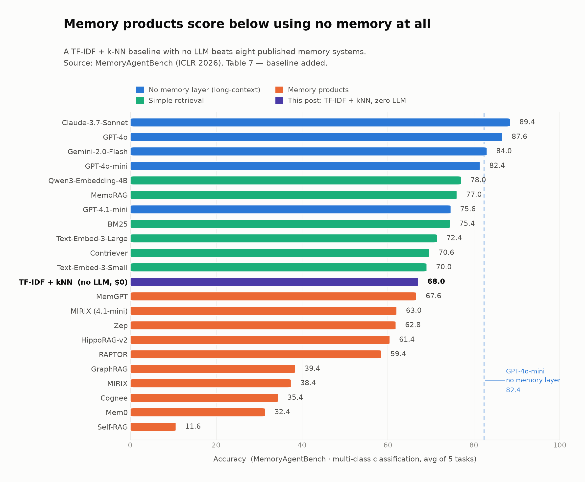
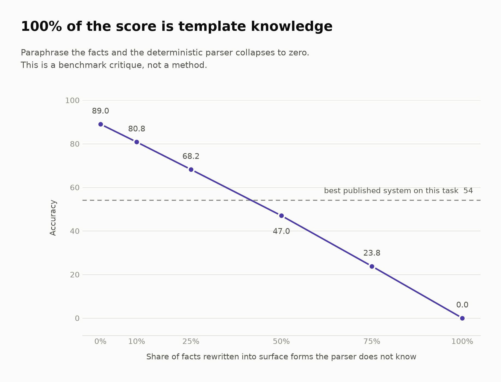

# memory-benchmark-baselines

Zero-LLM baselines for [MemoryAgentBench](https://huggingface.co/datasets/ai-hyz/MemoryAgentBench) (ICLR 2026).

No model calls. No embeddings. No training. No API key. Runs in seconds, costs nothing.

These exist to answer one question: **how much of a memory benchmark's difficulty is real?**

---

## Results



### Test-Time Learning / Multi-Class Classification

TF-IDF + k-NN over the in-context examples.

| | BANKING | CLINIC | NLU | TREC-C | TREC-F | **Avg** |
|---|---|---|---|---|---|---|
| This baseline | 77 | 76 | 70 | 72 | 45 | **68.0** |

For context, from MAB v3 Table 7: GPT-4o-mini with no memory layer 82.4 · BM25 75.4 · MemGPT 67.6 · Zep 62.8 · MIRIX 38.4 · Cognee 35.4 · Mem0 32.4 · Self-RAG 11.6.

The baseline places above eight of the published memory systems and below every long-context model.

### FactConsolidation (selective forgetting)

Template parser + "highest serial wins" policy.

| | 6K | 32K | 64K | 262K | **Avg** |
|---|---|---|---|---|---|
| single-hop | 90.0 | 94.0 | 85.0 | 87.0 | **89.0** |
| multi-hop | 15.0 | 12.0 | 10.0 | 11.0 | **12.0** |

MAB v3 reports the best published result as 54% single-hop, and all 22 systems at ≤7% multi-hop.

**But read the robustness numbers before quoting these.**

### Robustness: how much of that is template knowledge?



Facts rewritten into surface forms the parser does not know, serial numbers preserved:

| paraphrase rate | 0% | 10% | 25% | 50% | 75% | 100% |
|---|---|---|---|---|---|---|
| single-hop accuracy | 89.0 | 80.8 | 68.2 | 47.0 | 23.8 | **0.0** |

**All of it.** The FactConsolidation result is a benchmark critique, not a method. Below ~40% paraphrase-robustness the parser is worse than the published state of the art.

### The one number worth keeping

On questions the parser covers, single-hop accuracy is **96.6–100%**. The deterministic "take the newest serial" policy is essentially exact. Every point of loss sits in *semantic matching* — mapping a question to a relation.

```
semantic matching  →  model's job   (regex: 0% under paraphrase)
policy execution   →  code's job    (deterministic: ~100% within coverage)
```

This reproduces, from a different direction, the finding in [arXiv:2606.01435](https://arxiv.org/abs/2606.01435): separating evidence extraction from policy execution is what helps; swapping the policy executor from an LLM to deterministic code adds only 2.0 points.

---

## Follow-up: schema changes mid-run

[`experiments/schema_bump/`](experiments/schema_bump/) — a tool's schema changes
partway through an agent run; the agent must then call it correctly.

| memory arm | valid call |
|---|---|
| "newest schema wins" policy (~20 lines) | **100%** |
| full history in context | **95%** |
| Mem0 OSS 2.1.0 | **20%** |

And as runs grow from 20 to 200 events, Mem0 (queried with the agent's own
task) falls from 75% to 25% while full history stays at 24/24. Mem0 wrote
2,840 memories, every one an `ADD` — its documented v2 design — and the open
source ranker has no time signal. Details, caveats and the pitfalls we hit are
in that folder's README.

---

## Run it

```bash
pip install pyarrow
python fetch_data.py                   # pulls the public parquet splits
python mcc_tfidf_baseline.py           # Test_Time_Learning.parquet
python factconsolidation_baseline.py   # conflict_resolution.parquet
python robustness_paraphrase.py        # conflict_resolution.parquet
```

`charts.py` regenerates the charts (needs matplotlib).

## Files

| File | What it does |
|---|---|
| `factconsolidation_baseline.py` | FactConsolidation solver — 40 fact templates, compositional question parser, newest-serial policy |
| `robustness_paraphrase.py` | Paraphrase robustness curve |
| `mcc_tfidf_baseline.py` | TF-IDF + k-NN on Test_Time_Learning |
| `charts.py` | Charts |
| `experiments/schema_bump/` | Follow-up: tool schema changes mid-run, Mem0 vs full history vs a supersession policy (see below) |

## Method notes

- Metric is SubEM (substring exact match), as in MAB.
- Published comparisons use MAB v3 Table 7 and Table 17 values. **I did not re-run those systems** — same choice the post-retrieval-assembly paper makes, to avoid untracked implementation differences.
- MAB (July 2025) evaluated Mem0's earlier two-pass pipeline. Mem0 v2.0.0 (April 2026) replaced it with ADD-only extraction, so the Mem0 figure above describes a previous version. The `schema_bump` follow-up tests the current one.
- The FactConsolidation validity check: 55% of (subject, relation) groups carry conflicting values, and 95–100% of single-hop gold answers are the highest-serial fact. The task does measure temporal supersession.
- The parser covers 92–100% of facts per split depending on context length.

## Corrections welcome

If a number here is wrong, open an issue. The code is short and the data is public, so it should be quick to check.

## License

MIT
